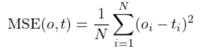
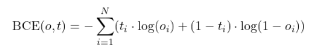

# Verwendung von Kreuzentropie als Verlustfunktion

Die Verwendung der Kreuzentropie als Verlustfunktion (auch bekannt als binäre Kreuzentropie oder Binary Cross-Entropy, BCE) anstelle einer mittleren quadratischen Fehlerfunktion (MSE) bringt spezifische Vorteile und Unterschiede, besonders wenn es um die Modellierung von Klassifikationsaufgaben geht.

## Unterschiede zwischen BCE und MSE

### Definition und Zweck:
- **MSE (Mean Squared Error)**:
  MSE misst den quadratischen Unterschied zwischen den vorhergesagten Werten \(o\) und den tatsächlichen Zielwerten \(t\). MSE wird typischerweise in Regressionsproblemen verwendet.
     

- **BCE (Binary Cross-Entropy)**:
  BCE misst die "Distanz" zwischen zwei Wahrscheinlichkeitsverteilungen – der vorhergesagten Wahrscheinlichkeit \(o\) und dem tatsächlichen Label \(t\). Sie ist besonders geeignet für binäre Klassifikationsprobleme.
  

### Anwendungsgebiet:
- **MSE**: Effektiv bei Regressionsaufgaben, wo das Ziel die Minimierung der Differenz zwischen den vorhergesagten und tatsächlichen kontinuierlichen Werten ist.
- **BCE**: Optimal für binäre Klassifikationsaufgaben, besonders wenn die Ausgaben als Wahrscheinlichkeiten interpretiert werden, wie es z.B. bei der Verwendung einer Sigmoid-Aktivierungsfunktion im letzten Layer eines neuronalen Netzwerks der Fall ist.

### Gradientenverhalten:
- **MSE**: Kann zu Problemen führen, wenn sie als Verlustfunktion in Klassifikationsmodellen verwendet wird, weil der Gradient möglicherweise nicht stark genug ist, um effektive Updates zu gewährleisten, besonders wenn die vorhergesagte Wahrscheinlichkeit sich stark vom Zielwert unterscheidet.
- **BCE**: Liefert einen stärkeren Gradienten in der Nähe von 0 und 1, was zu schnelleren und stabileren Konvergenzen in Klassifikationsmodellen führt. Dies ist besonders hilfreich, da Fehlklassifikationen einen großen Beitrag zum Gesamtverlust leisten.

### Empfindlichkeit:
- **MSE**: Weniger empfindlich gegenüber Unterschieden in den Wahrscheinlichkeitsverteilungen, vor allem bei kleinen Abweichungen nahe bei den Zielwerten.
- **BCE**: Sehr empfindlich gegenüber Unterschieden in den Wahrscheinlichkeitsverteilungen, besonders wenn die vorhergesagte Wahrscheinlichkeit nahe bei 0 oder 1 liegt, aber das tatsächliche Label anders ist. Dies kann zu hohen Verlustwerten führen, die das Modell effektiv "bestrafen".

## Implementierungshinweise

Wenn Sie die BCE in Ihrem Modell verwenden möchten, ist es wichtig, dass die Ausgabe Ihres Modells als Wahrscheinlichkeit interpretiert werden kann (d.h., sie muss zwischen 0 und 1 liegen). Daher ist die Nutzung einer Sigmoid-Aktivierungsfunktion im Ausgabelayer entscheidend, um sicherzustellen, dass die Werte in diesem Bereich liegen. Ebenso ist es wichtig, dass die Zielwerte \(t\) für jede Beobachtung entweder 0 oder 1 sind.

## Schlussfolgerung

Die Wahl zwischen MSE und BCE hängt stark von der Art der Aufgabe ab – Regressions- vs. Klassifikationsprobleme. Für binäre Klassifikationsaufgaben bietet die BCE signifikante Vorteile in Bezug auf das Lernen und die Modellkonvergenz gegenüber der MSE.
